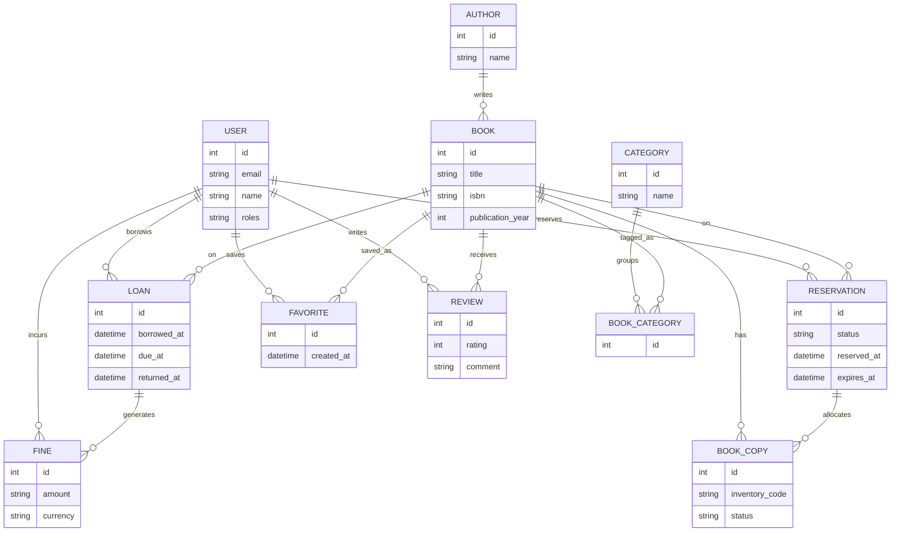

## ERD Diagram

The diagram below reflects the core library domain (minimum 5 tables).

```mermaid
erDiagram
  USER ||--o{ LOAN : borrows
  USER ||--o{ RESERVATION : reserves
  USER ||--o{ FINE : incurs
  USER ||--o{ FAVORITE : saves
  USER ||--o{ REVIEW : writes

  AUTHOR ||--o{ BOOK : writes
  BOOK ||--o{ BOOK_COPY : has
  BOOK ||--o{ LOAN : on
  BOOK ||--o{ RESERVATION : on
  BOOK ||--o{ REVIEW : receives
  BOOK ||--o{ FAVORITE : saved_as

  CATEGORY ||--o{ BOOK_CATEGORY : groups
  BOOK ||--o{ BOOK_CATEGORY : tagged_as

  LOAN ||--o{ FINE : generates
  RESERVATION ||--o{ BOOK_COPY : allocates

  USER {
    int id
    string email
    string name
    string roles
  }
  AUTHOR {
    int id
    string name
  }
  CATEGORY {
    int id
    string name
  }
  BOOK {
    int id
    string title
    string isbn
    int publication_year
  }
  BOOK_COPY {
    int id
    string inventory_code
    string status
  }
  LOAN {
    int id
    datetime borrowed_at
    datetime due_at
    datetime returned_at
  }
  RESERVATION {
    int id
    string status
    datetime reserved_at
    datetime expires_at
  }
  FINE {
    int id
    string amount
    string currency
  }
  FAVORITE {
    int id
    datetime created_at
  }
  REVIEW {
    int id
    int rating
    string comment
  }
  BOOK_CATEGORY {
    int id
  }
```
