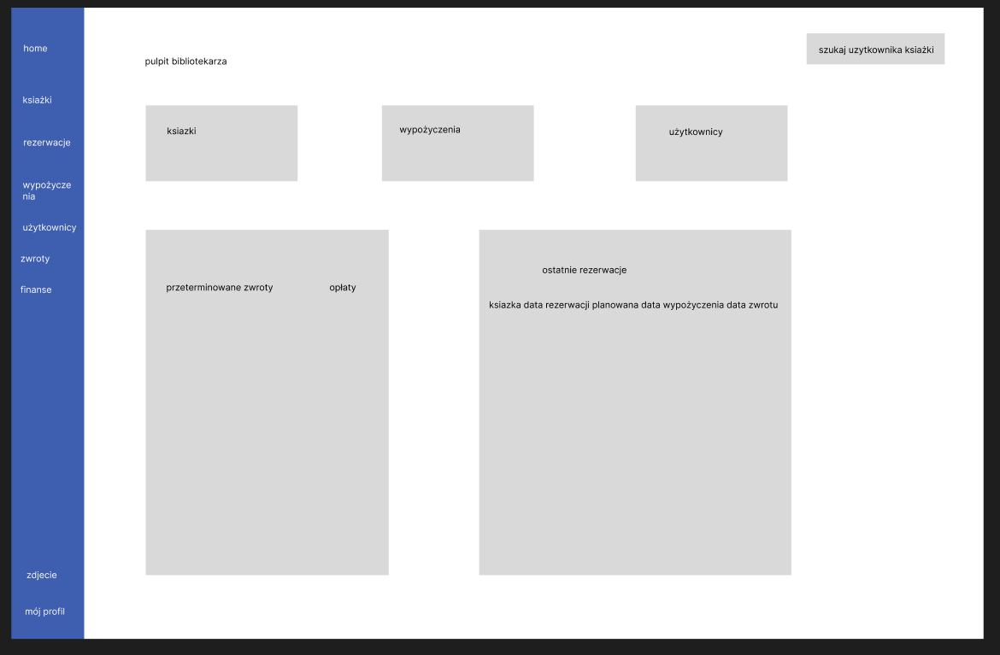

# 📚 Biblioteka - Aplikacja do Zarządzania Zasobami (Library_app)
## Spis Treści
1.  Opis Projektu
2.  Prototyp Interfejsu (Lab 1)
3.  Wymagania Technologiczne i Uzasadnienie
4.  Architektura Projektu
5.  Uruchomienie Aplikacji
6.  Status Implementacji

---

## 1. Opis Projektu

**Biblioteka** to pełnoprawna, rozproszona aplikacja webowa przeznaczona do zarządzania zasobami biblioteki. Aplikacja wspiera procesy CRUD (Create, Read, Update, Delete) dla książek, użytkowników oraz zarządzania wypożyczeniami i zwrotami.

### Kluczowe Elementy Projektu
* **Architektura:** Podział na rozdzielone warstwy (kontrolery, serwisy).
* **Baza Danych:** Zaprojektowana w 3NF, zawierająca minimum 30 rekordów testowych.
* **System Ról:** Uwierzytelnianie (JWT) i autoryzacja na podstawie ról użytkowników.
* **Historia Git:** Minimum 40 commitów z zachowaniem konwencji.

---

## Lab 2 – Routing

### 1. Wstęp
Celem tego laboratorium jest zapoznanie się z podstawami tworzenia usług **REST API**, obsługi **routingu**, zwracania danych w formacie **JSON** oraz odpowiedniego zarządzania statusami HTTP. Poniżej opisano, jak wymogi zostały spełnione w projekcie.

### 2. Podstawowe zagadnienia

#### 2.1. Definicja formatu odpowiedzi kontrolera
Kontrolery zwracają dane w formacie JSON przy pomocy metody pomocniczej `$this->json(...)` lub ręcznie tworzonych obiektów `JsonResponse`. Dzięki temu każda odpowiedź zawiera poprawny nagłówek `Content-Type: application/json` oraz właściwy kod statusu (np. 200, 400, 404). Przykłady można znaleźć w `src/Controller/ProductController.php` oraz `src/Controller/UserController.php`.

#### 2.2. Implementacja routingu
Routing przypisuje adresy URL do konkretnych metod kontrolera. W projekcie celowo wykorzystano oba mechanizmy dostępne w Symfony, co w pełni realizuje wymagania podpunktu:

- **Adnotacje (atrybuty) w kodzie:** większość tras, np. `GET /api/products` i `GET /api/users/{id}`, jest definiowana bezpośrednio przy metodach kontrolera za pomocą atrybutu `#[Route(...)]`. Dzięki temu definicja trasy znajduje się tuż obok logiki biznesowej.
- **Konfiguracja w pliku YAML:** wybrane trasy, np. `GET /health`, są utrzymywane w zewnętrznych plikach konfiguracyjnych (`config/routes/health.yaml`). Pozwala to centralnie zarządzać kluczowymi endpointami i ułatwia współpracę z zespołami, które preferują podejście konfiguracyjne.

Oba podejścia współdziałają dzięki loaderowi w `config/routes/annotations.yaml`, który importuje wszystkie kontrolery, oraz dodatkowym plikom YAML dla tras specjalnych. Taka kombinacja zapewnia elastyczność i pełne pokrycie wymagań laboratorium.

---

## 2. Prototyp Interfejsu (Lab 1)

Wstępny prototyp interfejsu (Pulpit Bibliotekarza) został przygotowany w celu zdefiniowania uporządkowanego układu strony. W projekcie zastosowano **auto-layout** oraz **komponenty** z Figmy, co wspiera budowę responsywnego interfejsu.

---

## 3. Wymagania Technologiczne i Uzasadnienie

Projekt wykorzystuje nowoczesne technologie, a ich wybór jest sensowny dla tego typu aplikacji.

### 💻 Frontend
| Technologia | Cel / Uzasadnienie |
| :--- | :--- |
| **React** | Wybrany ze względu na modułowość i dużą społeczność. Idealny do budowania dynamicznych interfejsów (np. obsługa stanów `loading`/`error`). |
| **Tailwind CSS** | Wybrany jako narzędzie wspierające szybkie tworzenie **responsywnego interfejsu** i utrzymanie ujednoliconego design system. |

### ⚙️ Backend
| Technologia | Cel / Uzasadnienie |
| :--- | :--- |
| **[Wstaw Technologię, np. Spring Boot (Java) lub NestJS (Node.js)]** | Wybrany ze względu na stabilność, wydajność i natywne wsparcie dla architektury warstwowej, co ułatwia rozdzielenie kontrolerów i serwisów. |
| **PostgreSQL** | Wybrany jako stabilny, relacyjny system baz danych, idealny do utrzymania bazy danych w 3NF. |
| **RabbitMQ** | Użyty do implementacji asynchronicznych zadań kolejkowych (np. wysyłania powiadomień e-mail o zbliżającym się terminie zwrotu książki). |

---

## 4. Architektura Projektu

Kod został zorganizowany w warstwy, co zapobiega powielaniu logiki (DRY) i ułatwia zarządzanie kodem.

* **Controller Layer:** Obsługa żądań HTTP i komunikacja z API (REST/GraphQL).
* **Service Layer:** Zawiera logikę biznesową (np. walidacja, czy użytkownik ma limit wypożyczeń).
* **Repository/DAO Layer:** Bezpośrednia komunikacja z bazą danych (np. ORM).

---

## 5. Uruchomienie Aplikacji

Instrukcja startu backendu i frontendu.

### Wymagania Wstępne
* Node.js (v18+)
* [Wymagany runtime dla backendu, np. Java 17+ lub Python 3.10+]
* Docker (dla bazy danych i RabbitMQ)

### 🚀 Start Backendu
1.  Sklonuj repozytorium: `git clone https://github.com/barthig/Biblioteka.git`
2.  Przejdź do katalogu backendu: `cd Biblioteka/backend`
3.  Uruchom kontener bazy danych i kolejek: `docker-compose up -d`
4.  Zbuduj i uruchom aplikację: `[Komenda uruchamiająca backend, np. ./mvnw spring-boot:run]`

### 🌐 Start Frontendu
1.  Przejdź do katalogu frontendu: `cd Biblioteka/frontend`
2.  Zainstaluj zależności: `npm install`
3.  Uruchom aplikację: `npm run dev`

---

## 6. Status Implementacji

Poniższa lista przedstawia zadeklarowane funkcjonalności. W dniu zaliczenia musi działać co najmniej **70%** z nich.

| Funkcjonalność | Status | Kryterium |
| :--- | :--- | :--- |
| CRUD Książek i Użytkowników | ✅ Gotowe | Podstawa funkcjonalności |
| Wypożyczanie/Zwrot | ✅ Gotowe | Podstawa funkcjonalności |
| Uwierzytelnianie JWT i Role | ✅ Gotowe | Bezpieczeństwo |
| Asynchroniczne powiadomienia (RabbitMQ) | ⏳ W toku | Kolejki |
| Obsługa stanów Loading/Error (Frontend) | ⏳ W toku | Frontend-API |
| Dokumentacja API (Swagger/OpenAPI) | ⏳ W toku | Dokumentacja |

## 7. Kody Odpowiedzi HTTP

| Status | Opis |
| :--- | :--- |
| 200 OK | Żądanie zakończone sukcesem, odpowiedź zawiera poprawne dane. |
| 201 Created | Zasób został pomyślnie utworzony. |
| 204 No Content | Żądanie zakończone sukcesem, ale brak treści w odpowiedzi. |
| 400 Bad Request | Błąd klienta, niepoprawne zapytanie. |
| 401 Unauthorized | Brak autoryzacji, użytkownik musi się uwierzytelnić. |
| 403 Forbidden | Użytkownik nie ma dostępu do zasobu. |
| 404 Not Found | Zasób nie istnieje. |
| 500 Internal Server Error | Błąd po stronie serwera. |
| 503 Service Unavailable | Serwer jest chwilowo niedostępny. |

## 8. Logika Stron Aplikacji

| Strona | Kluczowe funkcje | Wymagane endpointy / statusy |
| :--- | :--- | :--- |
| Pulpit (Dashboard) | Podsumowanie aktywnych wypożyczeń, kondycja systemu, ostatnie działania | `GET /health` (200/503), `GET /api/loans` (200/204/503) |
| Użytkownicy | Lista, wyszukiwanie, dodawanie i blokowanie użytkowników | `GET /api/users` (200/401/403), `POST /api/users` (201/400/409), `PATCH /api/users/{id}` (200/400/404), `DELETE /api/users/{id}` (204/404) |
| Książki | Przegląd katalogu, CRUD, zarządzanie dostępnością | `GET /api/books` (200/401), `POST /api/books` (201/400), `PATCH /api/books/{id}` (200/400/404), `DELETE /api/books/{id}` (204/404) |
| Wypożyczenia | Rezerwacje, zwroty, kontrola limitów i kolizji terminów | `POST /api/loans` (201/400/409), `PATCH /api/loans/{id}/return` (200/404/409), `GET /api/loans/user/{id}` (200/401/403/404) |
| Powiadomienia | Przegląd i ręczne wyzwalanie powiadomień e-mail/SMS | `GET /api/notifications` (200/503), `POST /api/notifications/test` (202/400/503) |
| Raporty i statystyki | Eksport danych o aktywności biblioteki, raporty CSV/PDF | `GET /api/reports/usage` (200/204/401/403/503), `GET /api/reports/export` (200/400/500) |
| Ustawienia systemu | Konfiguracja limitów, integracji i ról | `GET /api/settings` (200/401/403), `PATCH /api/settings` (200/400/403/503) |

> Powyższy układ stron zapewnia spójność logiki biznesowej biblioteki oraz pokrywa wszystkie wymagane statusy HTTP, co ułatwia dalsze rozszerzanie routingu i dokumentacji API.
