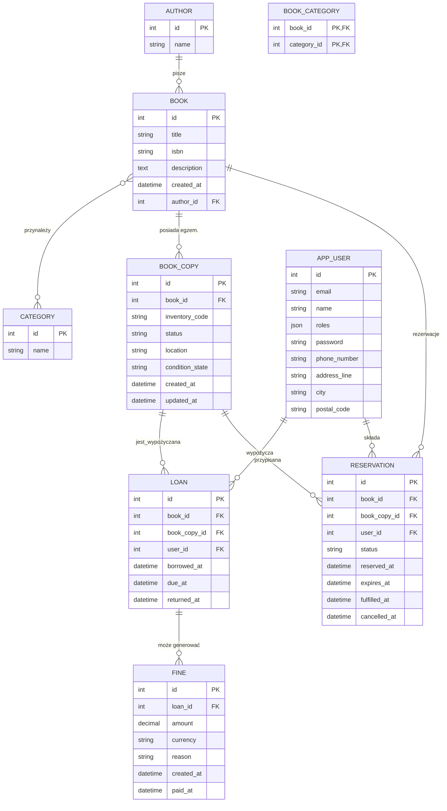

# Diagram ERD i model danych

Dokument opisuje relacyjny model danych aplikacji **Biblioteka** wraz z diagramem ERD oraz analizą tego, czy aktualna struktura wspiera kluczowe procesy systemu bibliotecznego.

---

## Diagram ERD

> Diagram można wygenerować lokalnie np. przy pomocy rozszerzenia VS Code _Markdown Preview Mermaid Support_ lub narzędzi online takich jak [Mermaid Live Editor](https://mermaid.live/).

---

## Opis relacji

- **Author → Book (1:N)** – każdy autor może mieć wiele książek, ale książka wskazuje jednego autora. Usunięcie autora jest blokowane (`RESTRICT`).
- **Book ↔ Category (N:M)** – książka może posiadać wiele kategorii tematycznych, a kategoria grupuje wiele książek. Relację utrzymuje tabela pośrednia `book_category` z kluczem złożonym.
- **Book → BookCopy (1:N)** – każda książka tworzy fizyczne egzemplarze (`BookCopy`). Usunięcie książki kaskadowo usuwa powiązane egzemplarze.
- **BookCopy → Loan (1:N)** – pojedynczy egzemplarz może być wielokrotnie wypożyczany, dlatego `Loan` wskazuje zarówno na książkę, jak i na konkretny egzemplarz.
- **User → Loan (1:N)** – użytkownik (czytelnik lub bibliotekarz) może mieć wiele wypożyczeń. Usunięcie użytkownika usuwa jego wypożyczenia (`CASCADE`).
- **Book/User ↔ Reservation** – rezerwacja dotyczy książki, a po zwolnieniu egzemplarza przypisywany jest konkretny `BookCopy`. Statusy (`ACTIVE`, `FULFILLED`, `CANCELLED`, `EXPIRED`) śledzą cykl życia rezerwacji.
- **Loan → Fine (1:N)** – każde wypożyczenie może wygenerować wiele kar, np. za przetrzymanie lub uszkodzenia.

Kluczowe atrybuty biznesowe:

- `book.totalCopies` i `book.copies` są synchronizowane automatycznie na podstawie encji `BookCopy` (status `AVAILABLE`/`RESERVED`/`BORROWED`/`MAINTENANCE`).
- `book_copy.status` sygnalizuje stan egzemplarza, co pozwala odróżnić egzemplarze wypożyczone, zarezerwowane i wyłączone z użytku (np. uszkodzone).
- `loan.returnedAt` pozwala odróżnić aktywne i zrealizowane wypożyczenia. Data zwrotu ustawiana jest po oddaniu egzemplarza.
- `app_user.roles` (JSON) obsługuje role (`ROLE_LIBRARIAN`, `ROLE_USER`), które sterują uprawnieniami w API.
- `reservation.expiresAt` definiuje termin odbioru egzemplarza, po którym rezerwacja automatycznie wygasa.
- `fine.amount` oraz `fine.paidAt` umożliwiają obsługę kar finansowych, w tym oznaczanie spłat.

---

## Ocena pokrycia potrzeb systemu bibliotecznego

Aktualny model realizuje wymagania podstawowe:

- katalog książek z autorami, kategoriami, opisami i kontrolą dostępnych egzemplarzy,
- fizyczne egzemplarze z indywidualnymi kodami inwentarzowymi, lokalizacją i stanem technicznym,
- użytkowników z rolami (czytelnicy, bibliotekarze) oraz podstawowymi danymi kontaktowymi,
- proces wypożyczeń powiązany z konkretnym egzemplarzem oraz rejestr kar,
- zachowanie 3NF – brak zduplikowanych danych, relacje znormalizowane, klucze obce wymuszają spójność,
- system rezerwacji obsługujący kolejkę oczekujących na egzemplarz,
- ponad 30 rekordów startowych dostarcza `backend/src/DataFixtures/AppFixtures.php` (10 autorów, 7 kategorii, 30 książek, 6 użytkowników, 15 wypożyczeń, zestaw rezerwacji i kar).

Elementy, które mogą być potrzebne w rozbudowanym systemie i warto rozważyć w dalszych etapach:

1. **Historia zmian egzemplarzy** – audyt dostępności lub log działań (np. tabela `book_inventory_log`).
2. **Powiadomienia/kolejki** – tabelaryczne monitorowanie stanu wysyłek (jeżeli zadania kolejkowe mają być rejestrowane w bazie).
3. **Rozszerzone dane kontaktowe użytkowników** – np. preferencje powiadomień, adresy korespondencyjne.
4. **Integracja z opłatami zewnętrznymi** – powiązanie tabeli `fine` z modułem płatności online.

W kontekście bieżących celów aplikacji (CRUD książek, wypożyczenia, autoryzacja) obecny model jest kompletny. Dodatkowe tabele można dodać iteracyjnie wraz z implementacją kolejnych wymagań funkcjonalnych.
